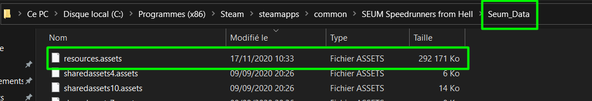
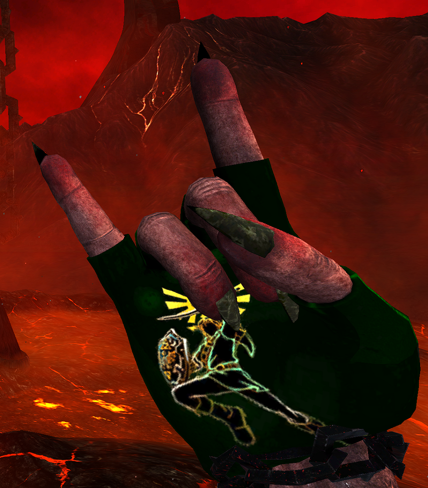
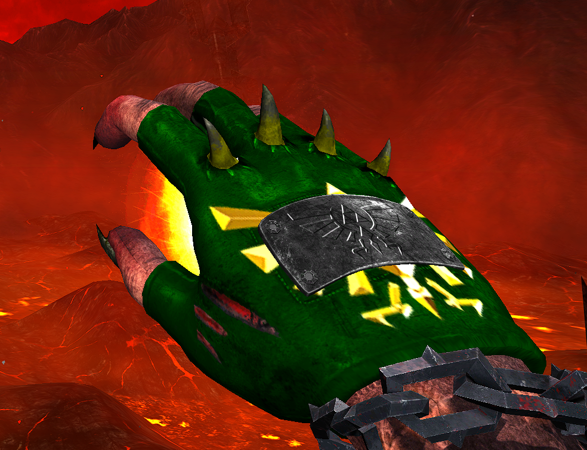
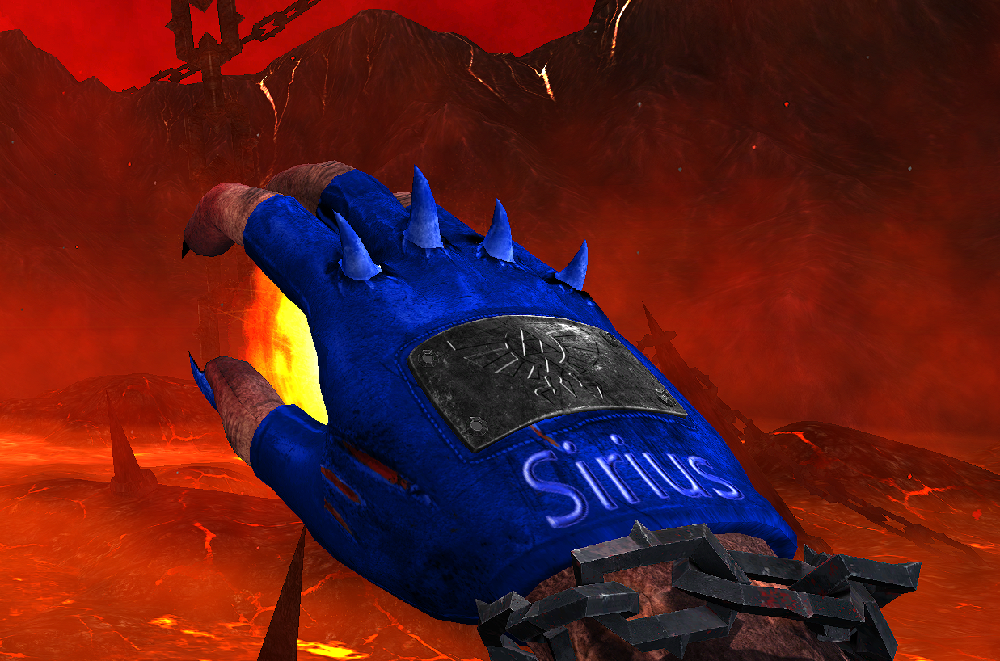
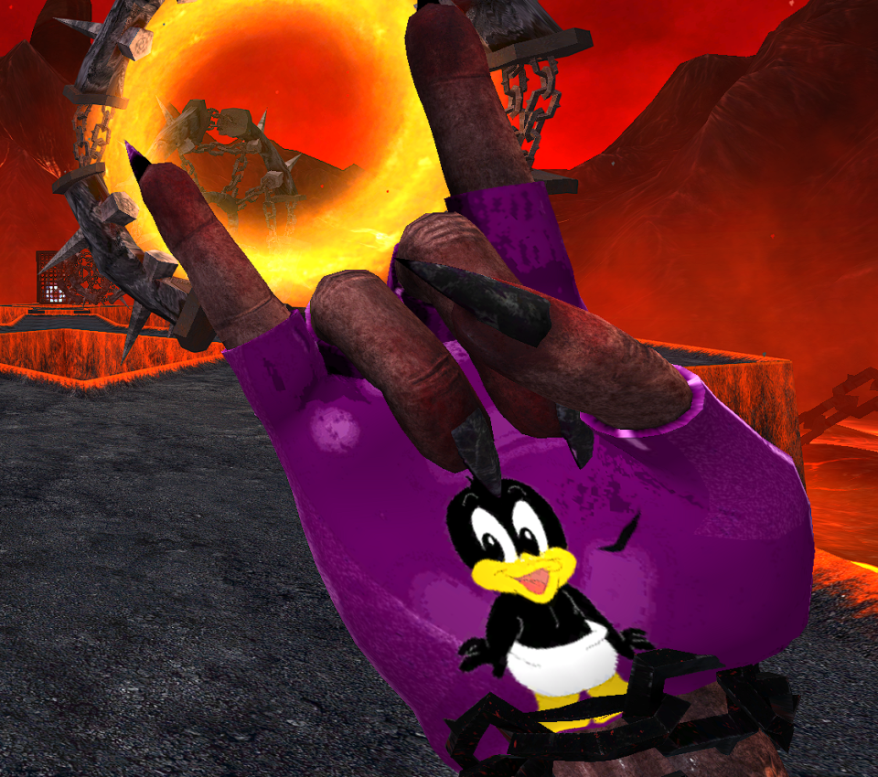
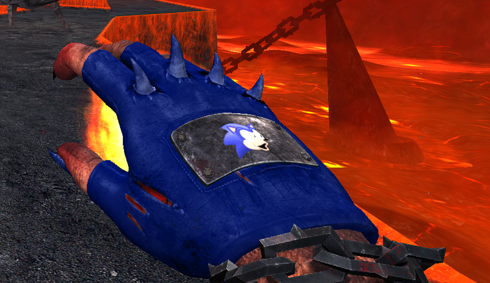

# Custom gloves
### How to install them ?
Download the glove you want
then drop the file (resources.assets) and replace the old here:
```
C:\Program Files (x86)\Steam\steamapps\common\SEUM Speedrunners from Hell\Seum_Data
```


Dont forget to select the default glove in game.
 * * *
## Link gloves



#### Download:
<a href="./gloves/link/resources.assets" download>
  
</a><br>
 &nbsp;&nbsp;resources.assets

 * * *
## Sirius gloves




#### Download:
<a href="./gloves/sirius/resources.assets" download>
  
</a><br>
 &nbsp;&nbsp;resources.assets

 * * *
## kornchiss gloves


#### Download:
<a href="./gloves/kornchiss/resources.assets" download>
  
</a><br>
 &nbsp;&nbsp;resources.assets

 * * *
## Daddy gloves



#### Download:
<a href="./gloves/daddy/resources.assets" download>
  
</a><br>
 &nbsp;&nbsp;resources.assets

* * *
## Unicorny gloves


#### Download:
<a href="./gloves/unicorny/resources.assets" download>
  
</a><br>
 &nbsp;&nbsp;resources.assets

 * * *
## Mixtraa gloves


#### Download:
<a href="./gloves/mixtraa/resources.assets" download>
  
</a><br>
 &nbsp;&nbsp;resources.assets
<div class="footer">

▬
<br>
 Made by Link | @Link#3779 on discord
</div>