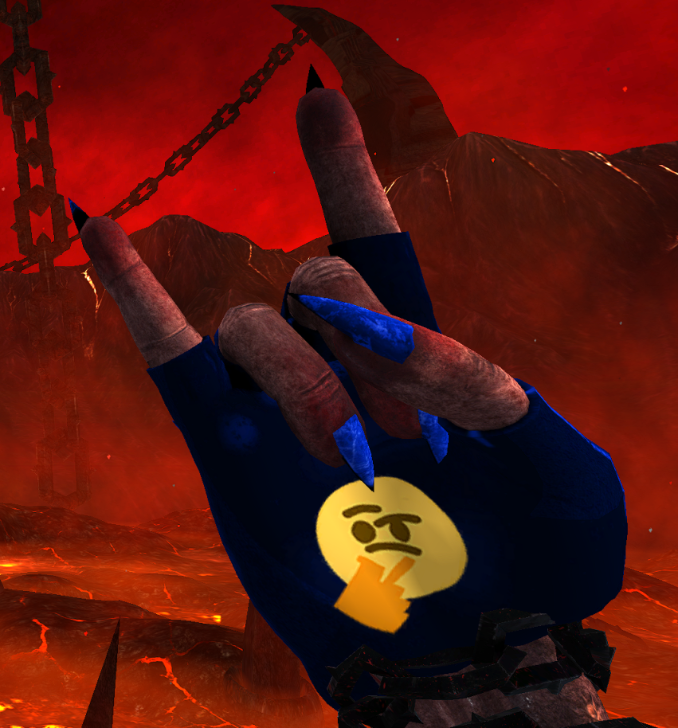

# Custom gloves
### How to install them ?
Download the glove you want
then drop the file (resources.assets) and replace the old here:
```
C:\Program Files (x86)\Steam\steamapps\common\SEUM Speedrunners from Hell\Seum_Data
```


Dont forget to select the default glove in game.
 * * *
## Link glove


#### Download:
<a href="https://drive.google.com/file/d/1t2chLIByh1_3JYvSytEihzQFarmfKJ6-/view?usp=sharing" target="_blank" download> 
  
</a><br>
 &nbsp;&nbsp;resources.assets

 * * *
## Sirius glove



#### Download:
<a href="https://drive.google.com/file/d/1OBhcTrOI5LI9A-pnL6xCCRcu-VzUYmHa/view?usp=sharing" target="_blank" download>
  
</a><br>
 &nbsp;&nbsp;resources.assets

 * * *
## kornchiss glove


#### Download:
<a href="https://drive.google.com/file/d/1wYQ2Xa3OVMfI3xkaJxQ8boJdHQPqD0f8/view?usp=sharing" target="_blank" download>
  
</a><br>
 &nbsp;&nbsp;resources.assets

 * * *
## Daddy glove


#### Download:
<a href="https://drive.google.com/file/d/1GWKxIqlM8P_QEQW97pGN55NmvuDioOdx/view?usp=sharing" target="_blank" download>
  
</a><br>
 &nbsp;&nbsp;resources.assets

* * *
## Unicorny glove


#### Download:
<a href="https://drive.google.com/file/d/1NE5YTTHNVi2T9PrU4gY5KAiOgG87yKvj/view?usp=sharing" target="_blank" download>
  
</a><br>
 &nbsp;&nbsp;resources.assets

 * * *
## Mixtraa glove


#### Download:
<a href="https://drive.google.com/file/d/1VaMogbfC68duVdwGNbABRNle-evB0Cpo/view?usp=sharing" target="_blank" download>
  
</a><br>
 &nbsp;&nbsp;resources.assets

  * * *
## Default glove

#### Download:
<a href="https://drive.google.com/file/d/1EwVzHEQw8GLoyMHBoY2RhZdNIZterhbf/view?usp=sharing" target="_blank" download>
  
</a><br>
 &nbsp;&nbsp;resources.assets

<div class="footer">

▬
<br>
 Made by Link | @Link#3779 on discord
</div>