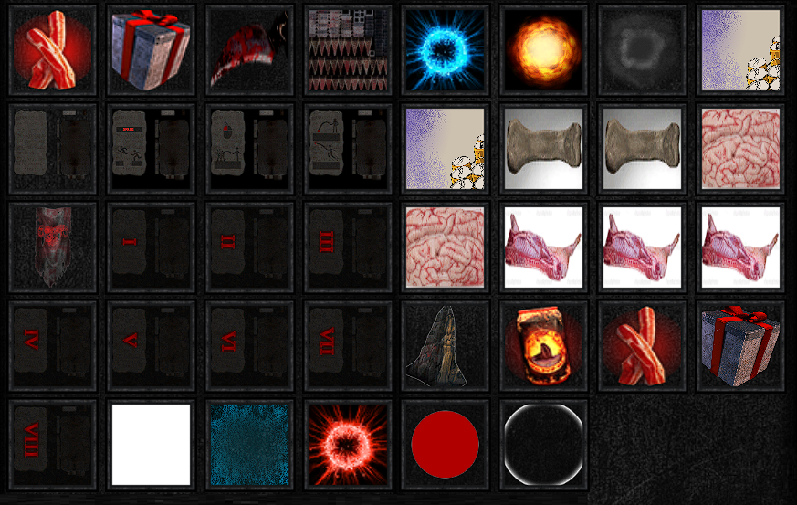

# Velocitymeter  

###  What is it ?
<p>The Velocitymeter is a plugin for Seum with many advanced features. Indeed, you can display your speed, angles, jump height, set a cycle, increase your fps, switch faster between the secrets/helikus maps, displaying a race ghost, improve your level editor and more. <br>Every options and the <a href="#download">download file</a> are listed below. </p>

* * *

## In Game features


<br>

- #### Meter options:

```
Vspeed : display hspeed and vspeed
PeakSpeed: Display your best peak speed above 12.18
Auto Reset Peak: Every time you hit the floor, the display of the peak speed is reset
Hspd Threshold : Use it to make your own threshold value 
(ex: above '1st case' display green, between "1st case" and "2nd case" = yellow, under "2nd case" = red)
Calculate Realtime: Display the real time of the run
Jump meter: Display your jump height
Display X / Y = display the angle(s)
Last run stats: show additional information of your last run
Edit range on the leaderboard: it's like a scrollable leaderboard, you can see every replays
FPS Boost: remove particles, effects, theme and blood to increase your fps
Ghost replay: enable it to see the ghost of the player you want
```

###  How to use the ghost feature ?

Enable it, choose a replay (load it) then press the `shift` key to load the ghost of this replay. <br>
Start you run and you will see his ghost.
You can edit the color and the opacity of the ghost.


- #### Maps Menu:

```
You can enter in a secret level by clicking on his number

Unreleased levels: You can try some unreleased maps
Prototypes levels: That's some testing/prototypes maps
```

- #### Game Tips:

```
Cycles: List of every maps cycles
Hellikus: Solutions of Hellikus secrets 
```
###  How to use the cycle list?

Be on a map, press `Q` (default key) to save the cycle and use `A` (default key) or `Scrollwheel` to load it.

- #### Settings:

```
Resolutions changer
Binds: If you want to edit the binds of the menu
Colors editor
Theme editor
```

- #### Saving settings:

Do not forget to save your settings by pressing `Save all settings`, to avoid any reset after every game restart.

* * *
## Pre-game features


- #### Seasons selector:

```
Seasons selector: You can change your season to see the old seasons
You cannot upload your runs on the old replays, you can only see the replays
Sadly, devs erased the old leaderboards.
```
- #### Leaderboard range editor:

```
Leaderboard range editor: above every lb, you can see a little box
Add the number you want and press 'set' to 'scroll' the leaderboad
```
* * *
## Level editor

New items, new themes, entities counters, new binds and more has been added on the level editor.



A little menu has been added too.

The items on this menu will make your level editor bugged, so add them at the end and save your level before !


* * *

## Wireframe

You can enable the wireframe option by pressing `F8` or disable it with `F9`.<br>
It is recommended to enable the "no theme" and "no particles" options.

<br>


* * *

## Download

###  How to install ?
Download the file Assembly-CSharp.dll below, replace the file (Make sure to have the same name to replace it), here:
```
C:\Program Files (x86)\Steam\steamapps\common\SEUM Speedrunners from Hell\Seum_Data\Managed
```
###  How to open ?

Use `Y` in game to open or `F1` for information and credit.

<balise id="download"></balise>

### Download file:
<a href="./doc/Assembly-CSharp.dll" download>
  
</a><br>
&nbsp;&nbsp;Assembly-CSharp.dll
<br><br>

###  How to uninstall ?
<p>Delete the Assembly-CSharp.dll file from Manager folder, then go on steam, Seum game -> properties -> local files -> Verify integrity of game files...  </p>

###  Credits
```
Link 
MrGentle
Judgy
chrisstar123
Sirius
Snail
ZM
Royal
Klooger
```

<div class="footer">

▬
<br>
 Made by Link | @Link#3779 on discord
</div>