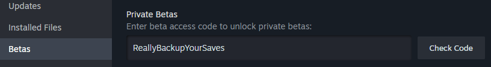
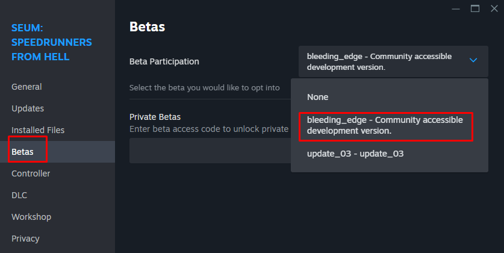
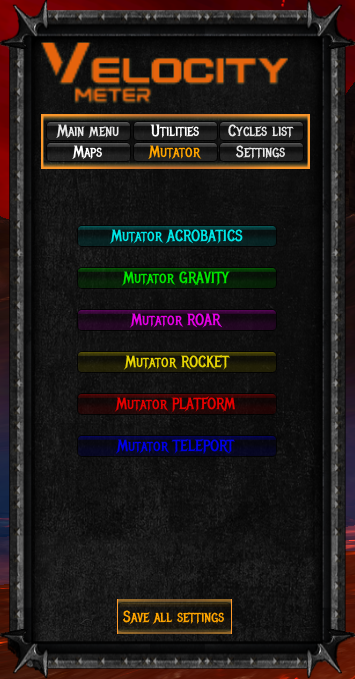
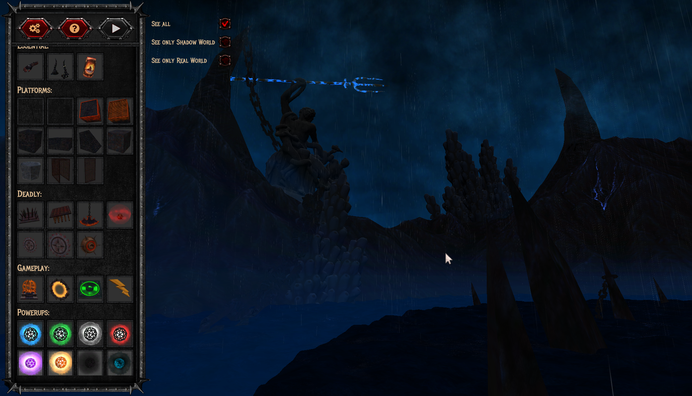
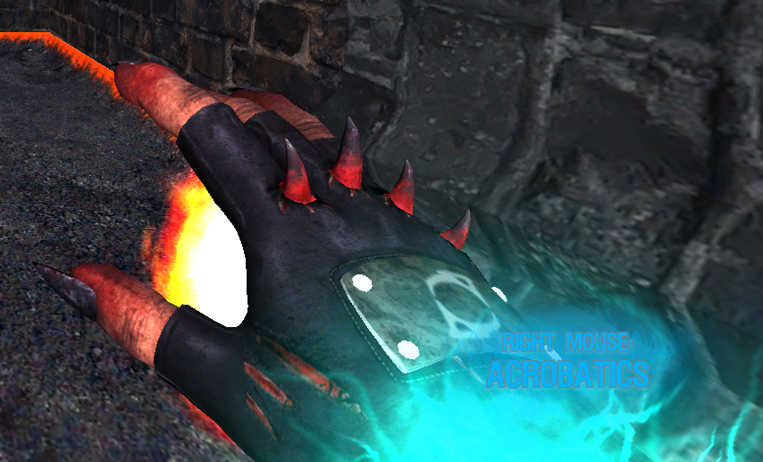

# Velocitymeter  

###  DLC2 ?
<p>Following the temporary pause of Seum, I have obtained permission from the developers at Pine Studio (Tom and SuperJura) as well as Sirius (thanks to them), to give you an exclusive preview of the upcoming DLC, including prototype maps and the new power through the Vmeter. <br><br>This will allow you to test and identify potential bugs. <br><br>Please refrain from contacting the developers, as the project is currently on standby from their side. <br><br> You need to be on the beta build bleeding-edge, released in 2021 to try this preview of the futur DLC2.</p>

* * *

## Connect to the beta
<p>Beta Code: ReallyBackupYourSaves<br>



<p>Choose the bleeding edge beta</p>



<br>Don't forget to make a copy of your files at C:\Users\user\AppData\LocalLow\Pine Studio\Seum beforehand, as you will lose your save when you switch back to the non-beta version.</p>
<br />

## Vmeter Beta DLC2

- #### Prototypes maps list:


```
Go Around
DLC 2_1
I'm on a boat
Catch Me
Go Down
222
Ziggurat
Double & Fly
Room 227
EasyPeasy
Bouble Bass
Wrong Turn
UP,UP,UP
Line Choice
Ugly Choices
Like Dolphin
Axe
Slalom
Short Straight
Urchins Kingdom
Edge Case
Whirpool
Modifier
Star Cube
Tornado Blist
```

- #### Mutator selector:



- #### Level Editor:

```
New Theme
New powerup
2 new items (maybe more later)
```


- #### New powerup:

<p> The new powerup is named Acrobatics. <br><br> It allows you to perform a double jump as well as a downward dash.</p>




- #### Todo list:

```
Level editor:
• Add all the stuff from the old vmeter
• Fix bug with mutator selector on hidden maps
```

- #### Known bugs:

```
Sometimes, the mutator doesnt work on the prototypes maps, you need to leave to the menu then go again inside.
I am looking to fix it.
```

## Download

###  How to install ?
Download the file Assembly-CSharp_DLC2.dll below, rename it Assembly-CSharp.dll, replace the file (Make sure to have the same name to replace it), here:
```
C:\Program Files (x86)\Steam\steamapps\common\SEUM Speedrunners from Hell\Seum_Data\Managed
```
###  How to open ?

Use `Y` in game to open or `F1` for information and credit.

<balise id="download"></balise>

### Download file:
<a href="./doc/Assembly-CSharp_DLC2.dll" download>
  
</a><br>
&nbsp;&nbsp;Assembly-CSharp_DLC2.dll
<br><br>

###  How to uninstall ?
<p>Delete the Assembly-CSharp.dll file from Manager folder, then go on steam, Seum game -> properties -> local files -> Verify integrity of game files...  </p>

<div class="footer">

▬
<br>
 @Link#3779 on discord
</div>